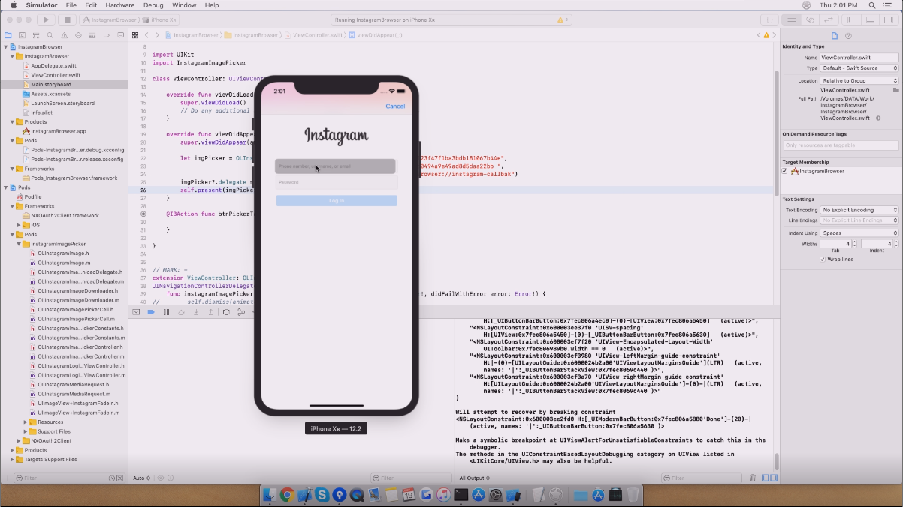

# InstagramBrowser

## Overview

This is simple instagram browser using instagram API

## Skills
    - swift 5.0
    - instagram api

## Contact Info

**_name_**:		_KmHk_

**_email_**:	[_kmhk.lu@aol.com_](mailto:kmhk.lu@aol.com)

**_git_**:		[_kmhk_](https://github.com/kmhk)

## Screen Video

